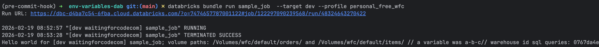

# Variables in Databricks Asset Bundles demo

1. Authenticate to your Databricks workspace, if you have not done so already:
    ```
    $ databricks configure
    ```

2. To deploy a development copy of this project, type:
    ```
    $ BROWSER="/Applications/Google Chrome.app/Contents/MacOS/Google Chrome" databricks auth login --profile personal_free_wfc 
    $ databricks bundle deploy --target dev --profile personal_free_wfc
    ```

# Try the demo
1. Deploy the job to your workspace:
    ```
    $ export BUNDLE_VAR_a_variable=a-b-c
    $ databricks bundle deploy --target dev --profile personal_free_wfc
    ```
2. Run a job and check the logs out to see if the variables were correctly resolved:
    ```
   $  databricks bundle run sample_job  --target dev --profile personal_free_wf
   ```
   You should see:
    