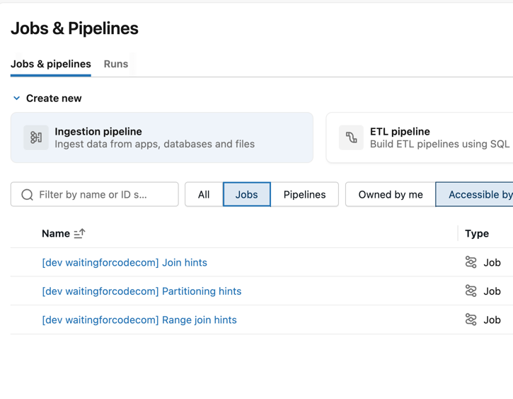
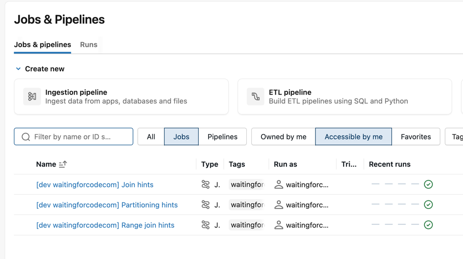

# Hints demo

1. Configure your Databricks workspace, if you haven't done it yet:
```shell
databricks configure
```

2. To deploy a development copy of this project, type:
```shell
BROWSER="/Applications/Google Chrome.app/Contents/MacOS/Google Chrome" databricks auth login --profile personal_free_wfc 
databricks bundle deploy --target dev --profile personal_free_wfc
```

3. You should see 3 notebooks deployed to your workspace:


4. You can now trigger each notebook and analyze the output:


5. Once you are done, clean up your workspace:
Delete the bundle:
```shell
databricks bundle destroy --target dev --profile personal_free_wfc
```

Delete the created tables:
```sql
DROP TABLE IF EXISTS orders;
DROP TABLE IF EXISTS customers;

DROP TABLE IF EXISTS events;
DROP TABLE IF EXISTS windows;

DROP TABLE IF EXISTS events_source_coalesced; 
DROP TABLE IF EXISTS events_source_rebalanced; 
DROP TABLE IF EXISTS events_source_rebalanced_country; 
DROP TABLE IF EXISTS events_source_repartitioned_2; 
DROP TABLE IF EXISTS events_source_repartitioned_country; 
DROP TABLE IF EXISTS events_source_repartitioned_country_4; 
DROP TABLE IF EXISTS events_source_repartitioned_range; 
DROP TABLE IF EXISTS events_source;
```