# Flows and configuration demo

1. Configure your Databricks workspace, if you haven't done it yet:
```shell
databricks configure
```

2. To deploy a development copy of this project, type:
```shell
BROWSER="/Applications/Google Chrome.app/Contents/MacOS/Google Chrome" databricks auth login --profile personal_free_wfc 
databricks bundle deploy --target dev --profile personal_free_wfc
```

## Private table
1. Create the demo raw table with the blog posts:
```sql
DROP TABLE IF EXISTS workspace.default.numbers;
CREATE TABLE workspace.default.numbers (
    number INT
);

INSERT INTO workspace.default.numbers VALUES (1), (2), (3), (4), (5);
```

2. Validate the table exists:
```sql
SELECT * FROM workspace.default.numbers;
```

You should see:
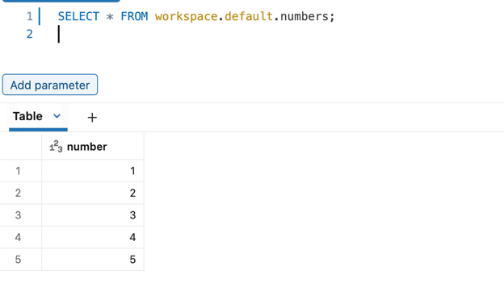

3. Explain the [private_table_demo.py](src/flows_and_configuration/private_table_demo.py)
* the job performs an intermediary calculation in a private table, i.e. a table that won't be 
  published but that can be used as a common source for downstream consumers

4. Start `private_table_demo.py` on Databricks. You should see:
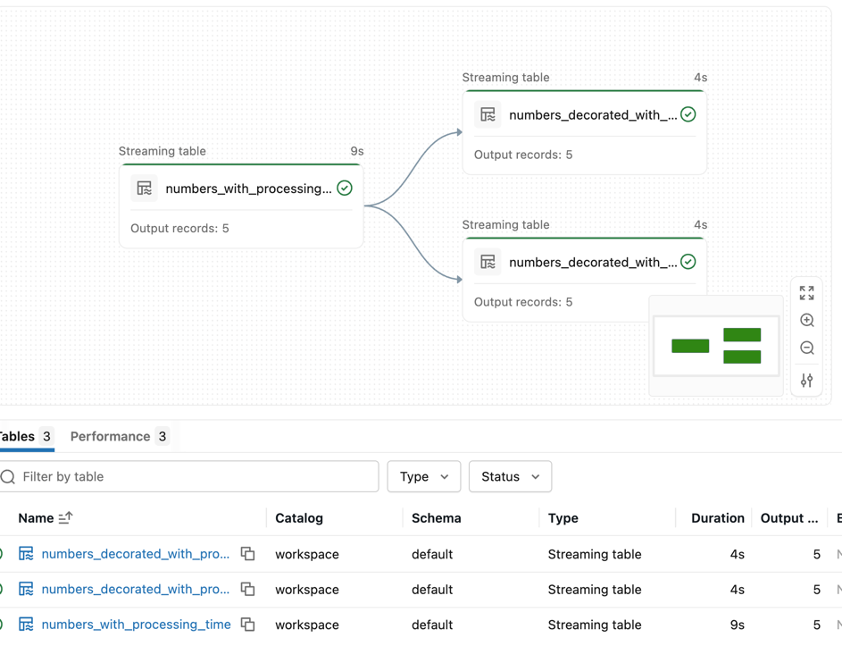

When you click on "See the table in the catalog", you should get this error:
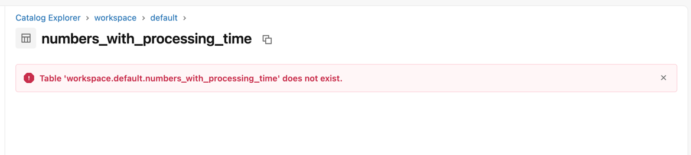

## Input parameters
1. Explain the [input_parameters.py](src/flows_and_configuration/input_parameters.py)
* the pipeline uses `input_parameters.expected_modulo` to apply a dynamic filter

2. Start `input_parameters.py` on Databricks. You should see:
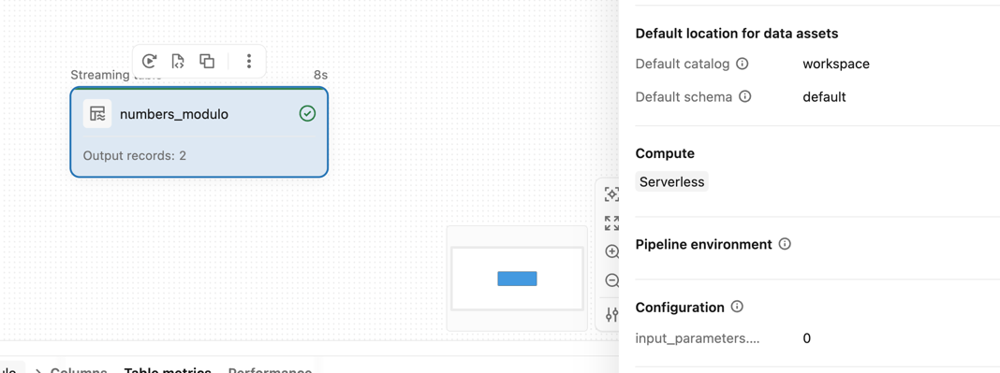

## ForeachBatch sink
1. Explain [foreach_batch_sink_demo.py](src/flows_and_configuration/foreach_batch_sink_demo.py)
* the job prints a DataFrame and writes its content to a Delta Lake table
* if it runs the first micro-batch, the write disposition overwrites everything while for others it 
appends data to the table

2. Start `foreach_batch_sink_demo.py` on Databricks. You should see:
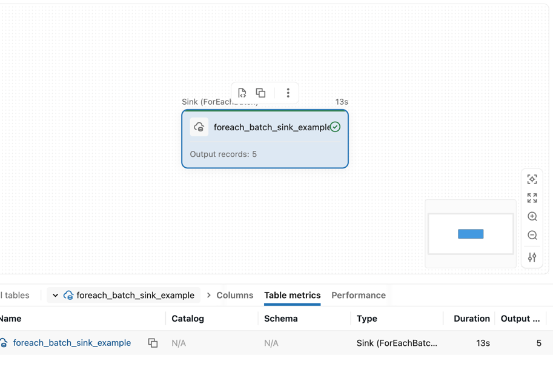

And the logs should be visible after clicking on the "View logs":
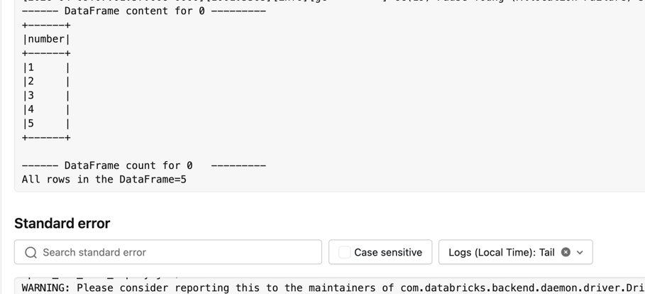

3. Explain [similar_to_foreach_batch_sink_demo.py](src/flows_and_configuration/similar_to_foreach_batch_sink_demo.py):
* it's similar to the `foreach_batch_sink_demo.py` because it also writes data to a table
  * we're going to use it to see the difference 

4.  Start `similar_to_foreach_batch_sink_demo.py` on Databricks. You should see:
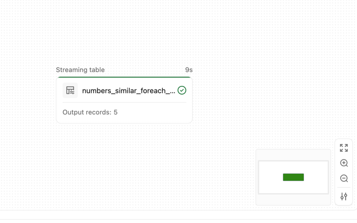**TODO** 

5. Add new records:
```sql
INSERT INTO workspace.default.numbers VALUES (6), (7), (8);
```

6. Start `foreach_batch_sink_demo.py` on Databricks. You should see:
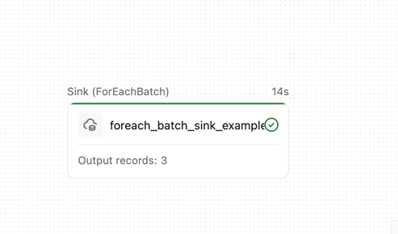

And in the logs:
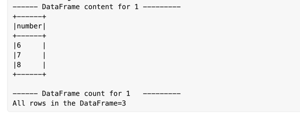

7. Start `similar_to_foreach_batch_sink_demo.py` on Databricks. You should see:
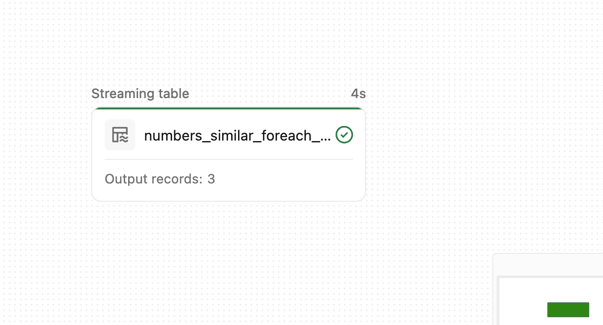

8. Trigger full refresh for `foreach_batch_sink_demo.py` on Databricks. You should see:
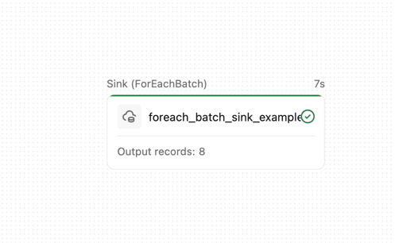

Thanks to a dedicated logic on the `overwrite`/`append` mode, the output table doesn't contain duplicates:
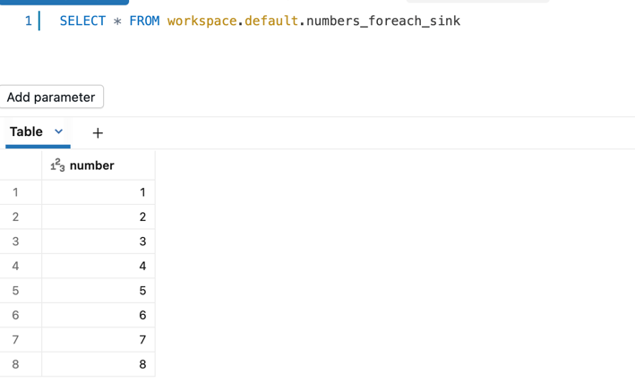

9. Trigger full refresh for `similar_to_foreach_batch_sink_demo.py` on Databricks. You should see:
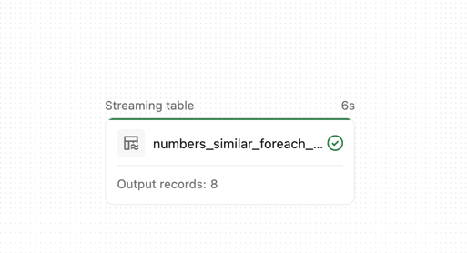

As you can see, the code is simpler than for the custom sink. Lakeflow takes care of the correct table semantics when it 
comes to running full refreshes.


## Continuous trigger
1. Explain [continuous_trigger_demo.py](src/flows_and_configuration/continuous_trigger_demo.py)
* the job consumes the numbers table continuously
* it triggers every 2 minutes; the schedule is defined in the resource YAML file: 
```
      configuration:
        pipelines.trigger.interval: "2 minutes"
```

2. Surprisingly, the pipeline is not marked with the _continuous_ mode on the UI:
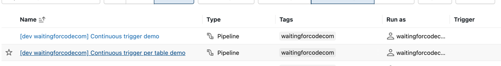

It's because of the Declarative Automation Bundle's _development_ mode that overrides the 
the disabled LSDP development mode:
```yaml
targets:
  dev:
    mode: development
```

To make the continuous mode work, you need to disable the dev mode and redeploy the DAB:
```yaml
targets:
  dev:
    #mode: development
```

and:
```shell
databricks bundle deploy --target dev --profile personal_free_wfc
```

3. The job should be now running continuously:
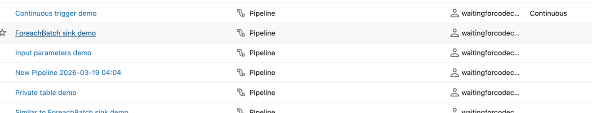

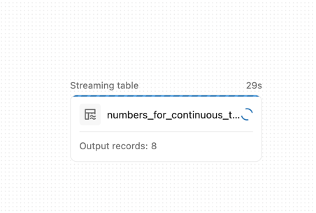

3. Add new data:
```sql
INSERT INTO workspace.default.numbers VALUES (9), (10), (11);
```

4. Wait 2 minutes and verify whether the pipeline automatically triggered.


5. Explain [continuous_trigger_per_table_demo.py](src/flows_and_configuration/continuous_trigger_per_table_demo.py)
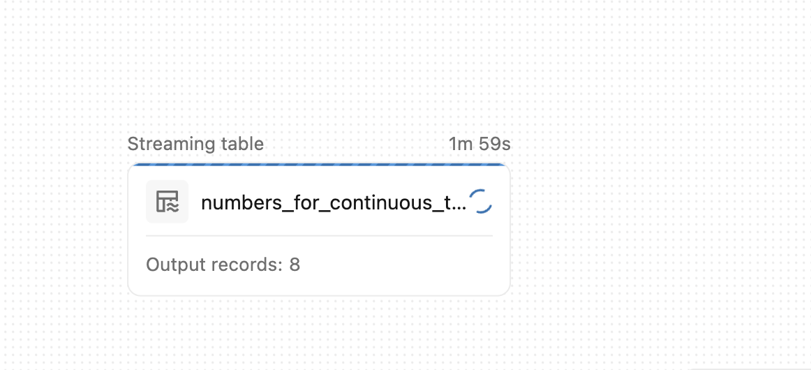
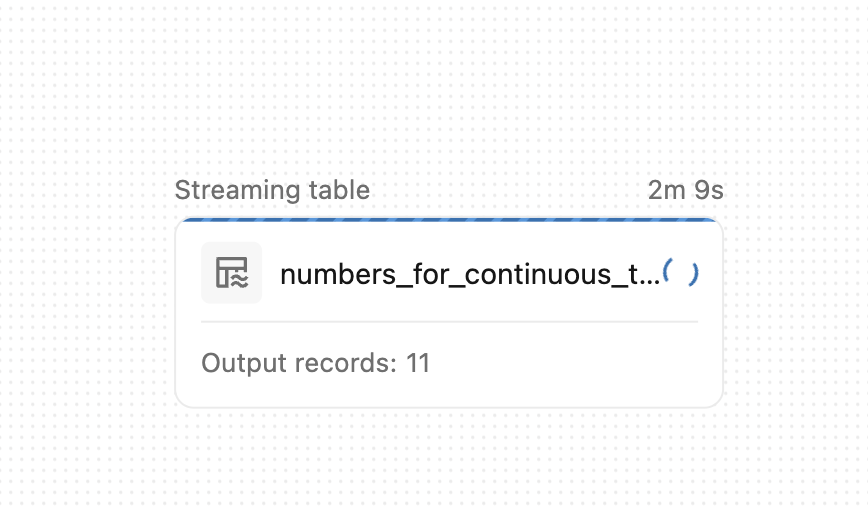

As you can see, the pipeline was waiting 2 minutes before refreshing the table. Despite that delay, 
it was still up and running.

6. Stop `continuous_trigger_demo.py`:
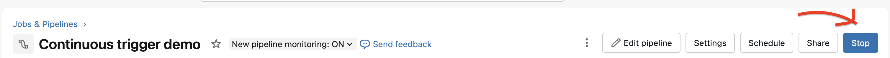

7. Explain [continuous_trigger_per_table_demo.py](src/flows_and_configuration/continuous_trigger_per_table_demo.py)
* the pipeline has two outputs that are refreshed at a different interval
  * the materialized view involving the full refresh gets refreshed every 5 minutes
  * the streaming table involving the append mode gets refreshed every 2 minutes

8. Rename the resource definition for the pipeline:
```shell
mv resources/continuous_trigger_per_table_demo.yml.tmp resources/continuous_trigger_per_table_demo.yml
```

9. Deploy the updated bundle:
```shell
databricks bundle deploy --target dev --profile personal_free_wfc
```

The new pipeline should be running:


10. Wait for both tables to be refreshed:

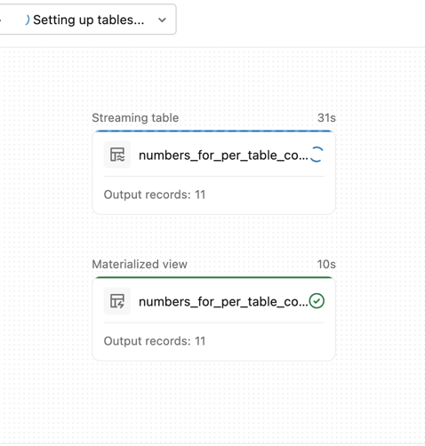

11. Add new data:
```sql
INSERT INTO workspace.default.numbers VALUES (12), (13), (14);
``` 

12. Wait 2 minutes to see the streaming table updated:

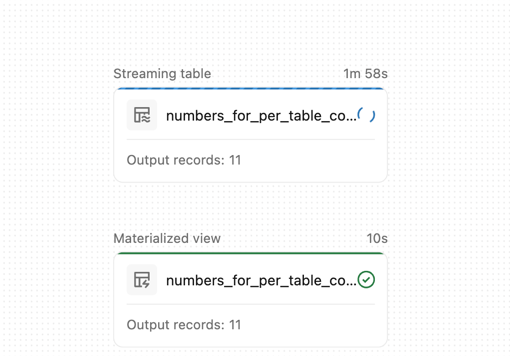
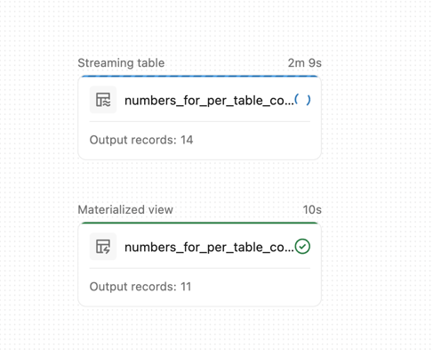

13. Wait 3 more minutes to see the materialized view refreshed:

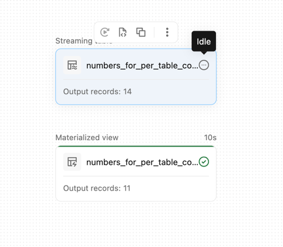

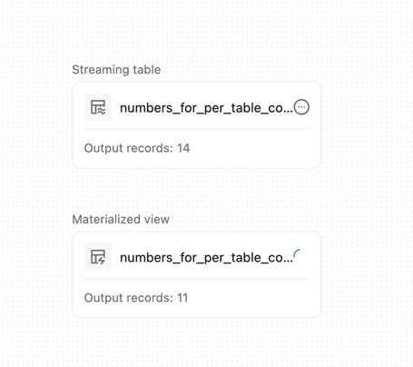

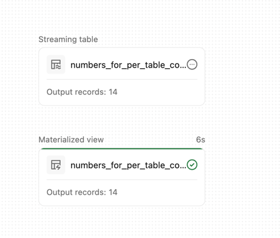

An interesting observation is the _idle_ status of the streaming job. Since it didn't get any new date
at its 4th minute of execution, it became idle.

## Clean up
1. Rename the resource definition for the pipeline:
```shell
mv resources/continuous_trigger_per_table_demo.yml resources/continuous_trigger_per_table_demo.yml.tmp
```

2. Destroy the bundle:
```shell
databricks bundle destroy --target dev --profile personal_free_wfc 
```

and 

```sql
DROP TABLE IF EXISTS workspace.default.numbers;
DROP TABLE IF EXISTS workspace.default.numbers_foreach_sink;
```

and uncomment the development mode in [databricks.yml](databricks.yml):
```yaml
targets:
  dev:
    mode: development
```