# Incremental refresh demo

1. Configure your Databricks workspace, if you haven't done it yet:
    ```
    $ databricks configure
    ```

2. To deploy a development copy of this project, type:
```shell
BROWSER="/Applications/Google Chrome.app/Contents/MacOS/Google Chrome" databricks auth login --profile personal_free_wfc 
databricks bundle deploy --target dev --profile personal_free_wfc
```

## Initial setup
1. Create the demo raw table with numbers:
```sql
DROP TABLE IF EXISTS workspace.default.raw_numbers_partitioned;
CREATE TABLE workspace.default.raw_numbers_partitioned (
    number INT, 
    word STRING
) PARTITIONED BY (number);

INSERT INTO workspace.default.raw_numbers_partitioned VALUES 
    (1, "a"), (2, "b"), (3, "c"), (4, "d");
```

# Append-only, partition overwrite and row-based strategies
1. Explain [append_partition_row_demo.py](src/incremental_refreshes/append_partition_row_demo.py)
* this pipeline shows all 3 incremental strategies from the title
* as you can see, it's a simple `SELECT` from the input table but despite this simplicity,
  depending on how your data producers change their datasets, different incremental refresh
  strategies will apply

2. Run `append_partition_row_demo.py`
3. Add new rows to the table:
```sql
INSERT INTO workspace.default.raw_numbers_partitioned VALUES 
    (1, "aa"), (2, "bb"), (3, "cc"), (4, "dd");
```

4. Run `append_partition_row_demo.py`. You should see the `Append` incremental strategy in the event log:
You can run this query:
```sql
SELECT timestamp, message
FROM event_log(TABLE(workspace.default.numbers_partitioned_output_for_append_partition_row_demo))
WHERE event_type = 'planning_information'
ORDER BY timestamp DESC;
```
...or click directly the last run's info in the UI:
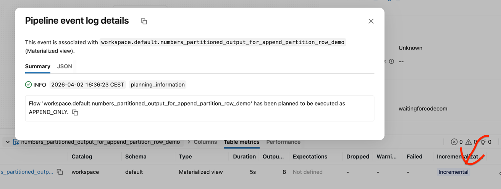

For the sake of clarity, we're going to use the second method in this demo.

5. Update existing rows:
```sql
UPDATE workspace.default.raw_numbers_partitioned SET word = "aaaa" WHERE number = 1 and word = "aa"
``````

6. Run `append_partition_row_demo.py`. You should see the `Partition overwrite` incremental strategy in the event log:
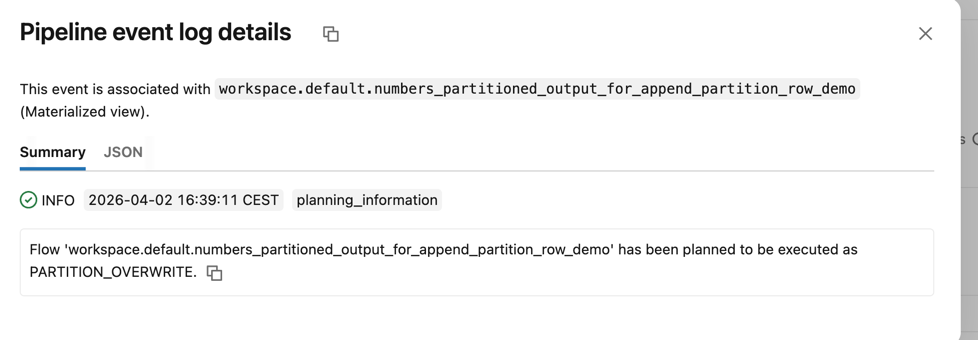

# Row-based strategy
1. Explain [row_demo.py](src/incremental_refreshes/row_demo.py)
* similar code to the previous one; the difference is the absence of the partition columns in the view
2. Run `row_demo.py`. You should see the `Complete recompute` incremental strategy since it's the first run.
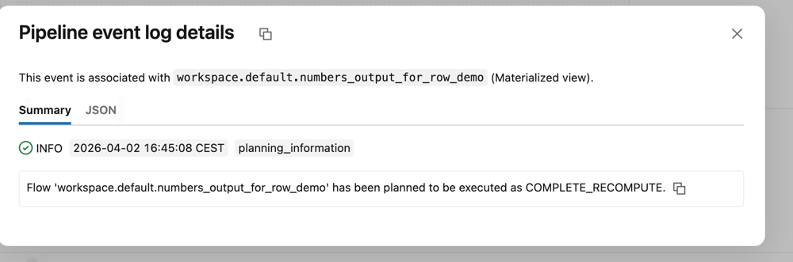
 
3. Replace one row:
```sql
UPDATE workspace.default.raw_numbers_partitioned SET word = "aa" WHERE number = 1 and word = "aaaa"
```
4. Run `row_demo.py`. You should see the `Row-based` incremental strategy since only one row has changed:
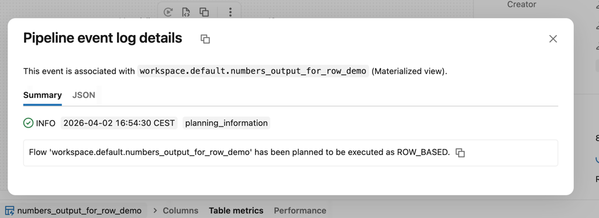


# Generic aggregate strategy
1. Recreate the table:
```sql
DROP TABLE IF EXISTS workspace.default.raw_numbers_partitioned;
DROP TABLE IF EXISTS workspace.default.numbers;
CREATE TABLE workspace.default.numbers (
    number INT, 
    word STRING
);

INSERT INTO workspace.default.numbers VALUES 
    (1, "a"), (2, "b"), (3, "c"), (4, "d");
```

2. Explain [generic_aggregate_demo.py](src/incremental_refreshes/generic_aggregate_demo.py)
* the pipeline performs a generic count distinct aggregation
3. Run `generic_aggregate_demo.py`. It should execute will full recompute.
4. Add additional rows, including one duplicate:
```sql
INSERT INTO workspace.default.numbers VALUES 
    (1, "a"), (1, "aa");
```
5. Run `generic_aggregate_demo.py`. It should execute will `Generic Aggregate` refresh:
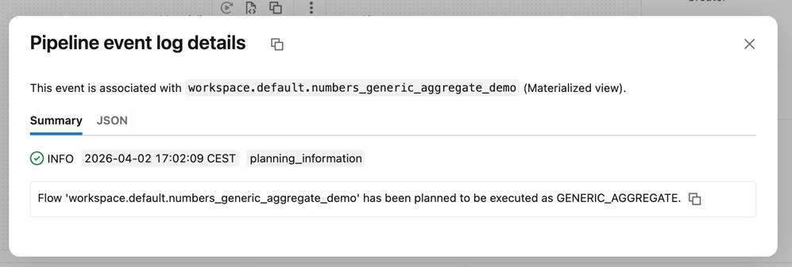

# Group aggregate strategy
1. Explain [group_aggregate_demo.py](src/incremental_refreshes/group_aggregate_demo.py)
* a key-based grouping function
2. Run `group_aggregate_demo.py`. It should be fully recomputed at this stage.
3. Add new rows impacting one of the groups:
```sql
INSERT INTO workspace.default.numbers VALUES 
    (1, "aaaaa"), (1, "aaaaaaaaa");
```
4. Run `group_aggregate_demo.py`. This time the strategy used for the refresh should be `Group Aggregate` since we modified a subset of the groups:
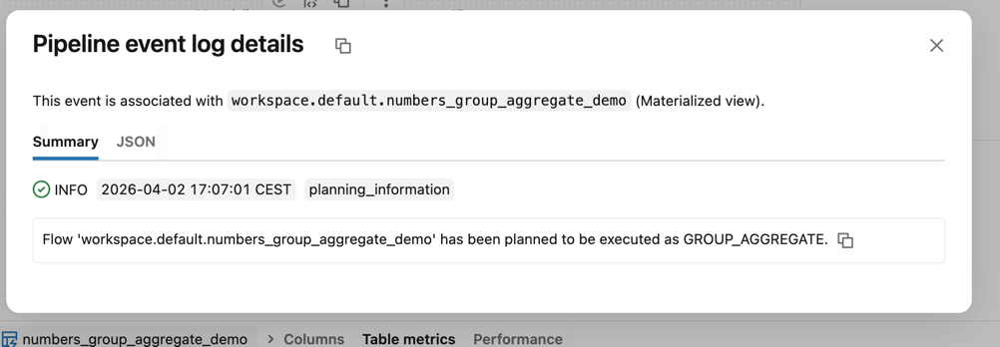

# Window strategy
1. Explain [window_demo.py](src/incremental_refreshes/window_demo.py)
* a simple `WINDOW`-based query that reads the previous and the next words for each group
2. Run `window_demo.py`. It should create the table from the full computate strategy.
3. Add a new row to one of the groups:
```sql
INSERT INTO workspace.default.numbers VALUES 
    (1, "aaaaaaa"), (1, "aaaaaaaaaaaaaaa");
```
4. Run `window_demo.py`. It should be refreshed with `Window-based` strategy:
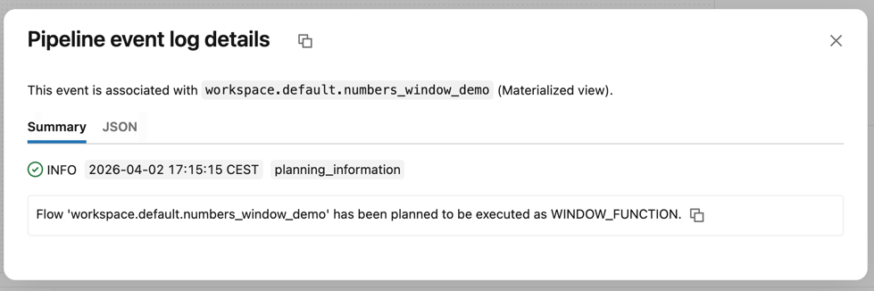

# Broken incremental strategies
1. In this last part we're going to see when the incremental strategy doesn't work.
2. Explain [broken_append_partition_row_demo.py](src/incremental_refreshes/broken_append_partition_row_demo.py)
* the simplest way to break the `Append-only` incremental strategy is to use a non deterministic function
3. Run `broken_append_partition_row_demo.py`. The table should be create with `Full recompute` strategy.
4. Add new row:
```sql
INSERT INTO workspace.default.numbers VALUES 
    (2, "bb"), (2, "bbb");
```
5. Run `broken_append_partition_row_demo.py`. You should see the table being fully recomputed with an additional informaton why:
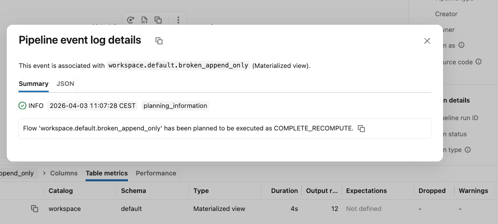
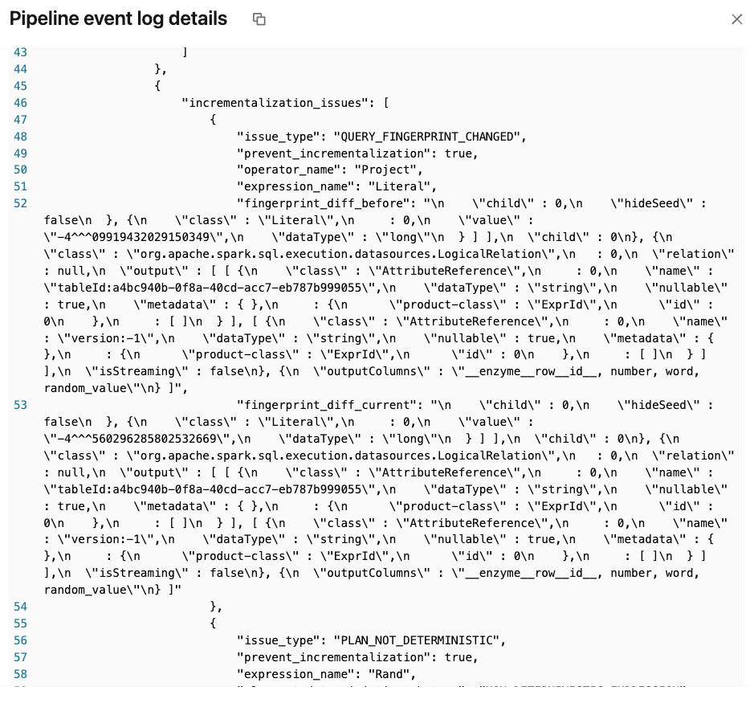

6. Another change breaking the incremental strategy is the lack of partitioning in the `WINDOW` function. 
7. Explain [broken_window_demo.py](src/incremental_refreshes/broken_window_demo.py)
* the pipeline doesn't have the partitioning meaning it's one global window; the table naturally
has to be fully recomputed every time
8. Run `broken_window_demo.py`. The table should be fully recomputed.
9. Let's add new rows:
```sql
INSERT INTO workspace.default.numbers VALUES 
    (1, "aaa"), (2, "bbbbbbbbbbb");
```
10. Run `broken_window_demo.py`. The table should be fully recomputed.

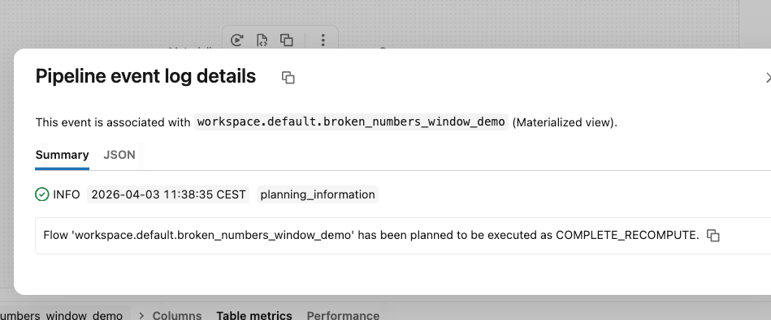
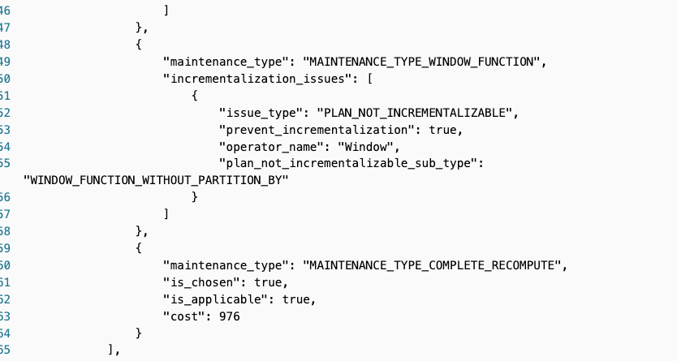

11. Clean the demo resources up:
```shell
databricks bundle destroy --target dev --profile personal_free_wfc
```
and 
```sql
DROP TABLE IF EXISTS workspace.default.numbers;
DROP TABLE IF EXISTS workspace.default.raw_numbers_partitioned;
```

