# Slowly Changing Dimensions demo

1. Configure your Databricks workspace, if you haven't done it yet:
    ```
    $ databricks configure
    ```

2. To deploy a development copy of this project, type:
    ```
    $ BROWSER="/Applications/Google Chrome.app/Contents/MacOS/Google Chrome" databricks auth login --profile personal_free_wfc 
    $ databricks bundle deploy --target dev --profile personal_free_wfc
    ```

## SCD with Change Data Capture - the demo
1. Create the demo raw table with the blog posts:
```sql
DROP TABLE IF EXISTS workspace.default.blog_posts_raw;
CREATE TABLE workspace.default.blog_posts_raw (
    id STRING, 
    title STRING,
    category STRING,
    operation STRING,
    date_changed TIMESTAMP
);

INSERT INTO workspace.default.blog_posts_raw VALUES 
    ('sdp_intro', 'Spark Declarative Pipelines, the introduction', 'Apache Spark', 'INSERT', NOW()),
    ('sdp_further', 'Spark Declarative Pipelines, going further', 'Apache Spark', 'INSERT', NOW()),
    ('sdp_internals', 'Spark Declarative Pipelines, internals', 'Apache Spark', 'INSERT', NOW());
```

2. Validate the table exists:
```sql
SELECT * FROM default.scd_demo.blog_posts_raw;
```

You should see:
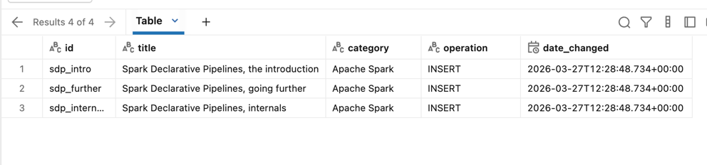

3. Explain the [scd_type_1.py](src/scd/scd_type_1.py)
* it's the code required for SCD Type 1;
  * as you can see, it's purely declarative, you define the behavior when the rows should be 
    modified (versioned), deleted, or when the whole table should be truncated

4. Explain the [scd_type_2.py](src/scd/scd_type_2.py)
* the configuration is quite similar to `scd_type_1`; the difference is the value of the 
    `stored_as_scd_type` column that clearly indicates type 2

4. Start `scd_type_1.py` on the Databricks workspace. It should upsert 3 records:
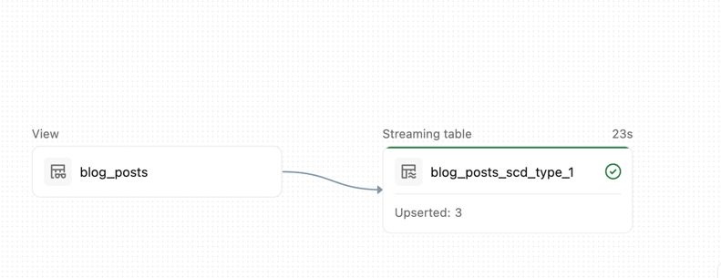

5. Start `scd_type_2.py` on the Databricks workspace.  It should upsert 3 records:
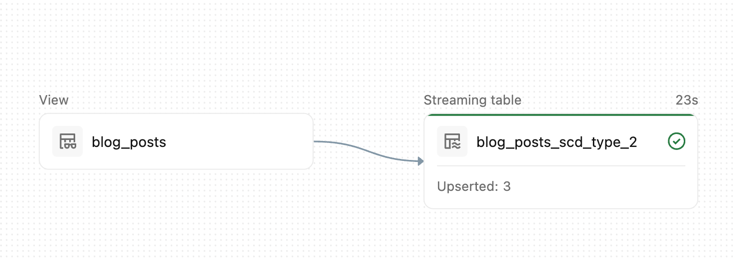


6. Check the _blog_posts_scd_type_1_ table:
```sql
SELECT * FROM  workspace.default.blog_posts_scd_type_1
```
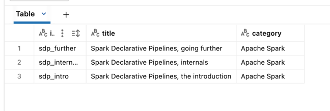
No surprise, the table is identical to the blog_posts_raw.

7. Check the _blog_posts_scd_type_2_ table:
```sql
SELECT * FROM  workspace.default.blog_posts_scd_type_2
```

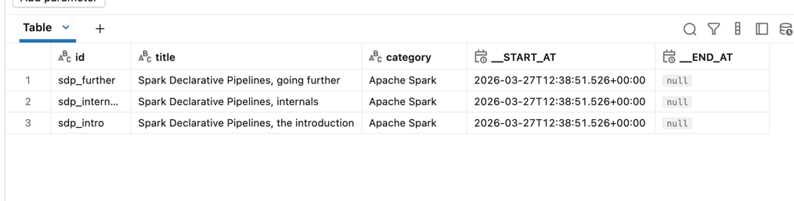
Here the content is almost identical. You should notice additional date-validity columns.

8. Let's change the category for raw table:
```sql
INSERT INTO workspace.default.blog_posts_raw VALUES 
('sdp_intro', 'Spark Declarative Pipelines, the introduction', 'Apache Spark Structured Streaming', 'UPDATE', NOW()),
('sdp_further', 'Spark Declarative Pipelines, going further', 'Apache Spark Structured Streaming', 'UPDATE', NOW()),
('sdp_internals', 'Spark Declarative Pipelines, internals', 'Apache Spark Structured Streaming', 'UPDATE', NOW());
```

9. Run the  `scd_type_1.py` and  `scd_type_2.py` pipelines again.

10. Check the _blog_posts_scd_type_1_ table:
```sql
SELECT * FROM  default.scd_demo.blog_posts_scd_type_1
```

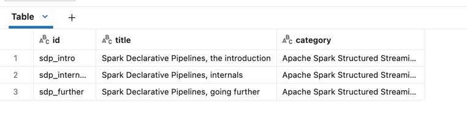
No surprise, since SCD Type 1 overwrites the rows, the table is identical to the blog_posts_raw.


11. Check the _blog_posts_scd_type_2_ table:
```sql
SELECT * FROM  default.scd_demo.blog_posts_scd_type_2
```
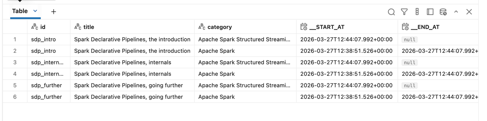
As you can see, the changes are versioned with the start/end date columns.

12. Finally, let's add a _DELETE_ event to see how the SCD rows are removed:
```sql
INSERT INTO workspace.default.blog_posts_raw VALUES 
('sdp_intro', 'Spark Declarative Pipelines, the introduction', 'Apache Spark Structured Streaming', 'DELETE', NOW())
```
13. Check the SCD tables:
```sql
SELECT * FROM  default.scd_demo.blog_posts_scd_type_1
```
For this SCD Type 1 the removed operation simply triggered rows removal:
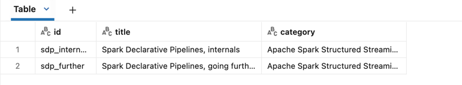

```sql
SELECT * FROM  default.scd_demo.blog_posts_scd_type_2
```
For the SCD Type 2 the removed record (sdp_intro) just got the end_date defined:
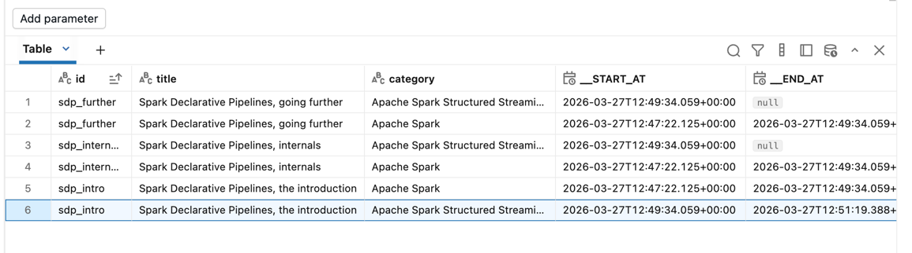

## SCD with snapshots - the demo
1. Recreate the table:
```sql
DROP TABLE IF EXISTS workspace.default.blog_posts_raw;
CREATE TABLE workspace.default.blog_posts_raw (
    id STRING, 
    title STRING,
    category STRING
);

INSERT INTO workspace.default.blog_posts_raw VALUES 
    ('sdp_intro', 'Spark Declarative Pipelines, the introduction', 'Apache Spark'),
    ('sdp_further', 'Spark Declarative Pipelines, going further', 'Apache Spark'),
    ('sdp_internals', 'Spark Declarative Pipelines, internals', 'Apache Spark');

```

2. Explain [scd_type_1_snapshot.py](src/scd/scd_type_1_snapshot.py):
* the code for the snapshot version looks like defining the SCD table declaration
  * you won't find time-related columns
* an important difference with the CDC methods is the upstream table which cannot be
  a streaming table; after all, we deal with full snapshots, so to compare the content 
  of the snapshots we always need the full picture

3. Explain [scd_type_2_snapshot.py](src/scd/scd_type_2_snapshot.py)
* the single difference here is the SCD type set to 2

4. Run scd_type_1_snapshot and scd_type_2_snapshot.

5. Check the content of the both output tables:
```sql
SELECT * FROM  default.scd_demo.blog_posts_scd_type_1_snapshot
```
For this SCD Type 1 the input table is simply the output table:
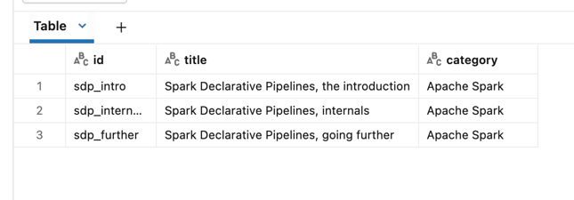

```sql
SELECT * FROM  default.scd_demo.blog_posts_scd_type_2_snapshot
```
For the Type 2 you can see the two versioning columns defined as:
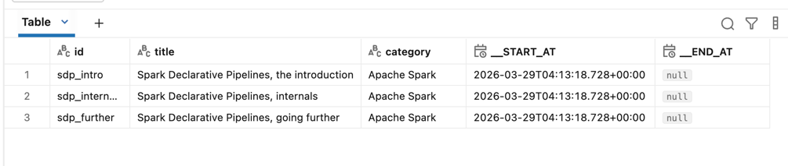

6. Let's now replace the content of the table:
```sql
TRUNCATE TABLE workspace.default.blog_posts_raw;
INSERT INTO workspace.default.blog_posts_raw VALUES 
('sdp_intro', 'Spark Declarative Pipelines, the introduction', 'Apache Spark Structured Streaming'),
('sdp_further', 'Spark Declarative Pipelines, going further', 'Apache Spark Structured Streaming'),
('sdp_internals', 'Spark Declarative Pipelines, internals', 'Apache Spark Structured Streaming');
```

7. Run the two SCD pipelines again.

8. Check the output:
```sql
SELECT * FROM  default.scd_demo.blog_posts_scd_type_1_snapshot
```
For this SCD Type 1 the input table is simply the output table:
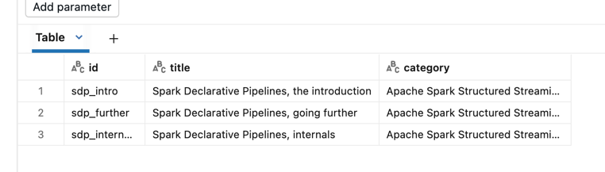

```sql
SELECT * FROM  default.scd_demo.blog_posts_scd_type_2_snapshot
```
For the Type 2 you can see the two versioning columns defined as:
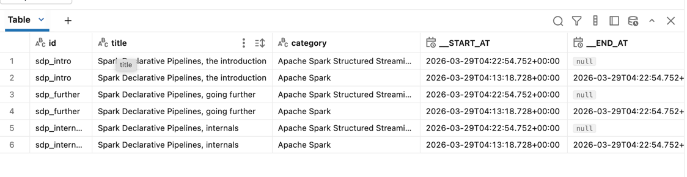

9. Finally, let's see the delete operation:
```sql
TRUNCATE TABLE workspace.default.blog_posts_raw;
INSERT INTO workspace.default.blog_posts_raw VALUES 
('sdp_further', 'Spark Declarative Pipelines, going further', 'Apache Spark Structured Streaming'),
('sdp_internals', 'Spark Declarative Pipelines, internals', 'Apache Spark Structured Streaming');
```
10. Run the two SCD pipelines again.

11. Check the output:
```sql
SELECT * FROM  default.scd_demo.blog_posts_scd_type_1_snapshot
```
For this SCD Type 1 the input table is simply the output table:
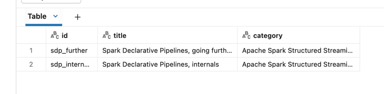

```sql
SELECT * FROM  default.scd_demo.blog_posts_scd_type_2_snapshot
```
For the Type 2 you can see the removal action executed the same way as for the CDC-based SCD Type 2 table:
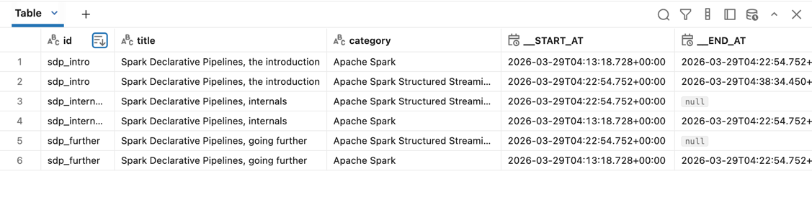

## SCD and determinism - the demo
1. Let's now modify the input by running this query:
```sql
TRUNCATE TABLE workspace.default.blog_posts_raw;
INSERT INTO workspace.default.blog_posts_raw VALUES 
('sdp_further', 'Spark Declarative Pipelines, going further', 'Apache Spark Structured Streaming'),
('sdp_internals', 'Spark Declarative Pipelines, internals', 'Apache Spark Structured Streaming'),
('sdp_internals', 'Spark Declarative Pipelines, THE internals', 'Apache Spark Structured Streaming');
```

2. Run both pipelines.

3. Both pipelines should fail at the same stage of processing the input table:

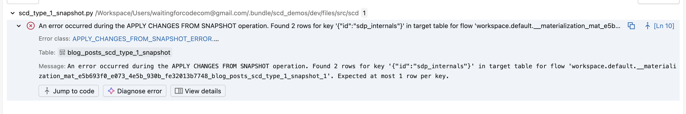
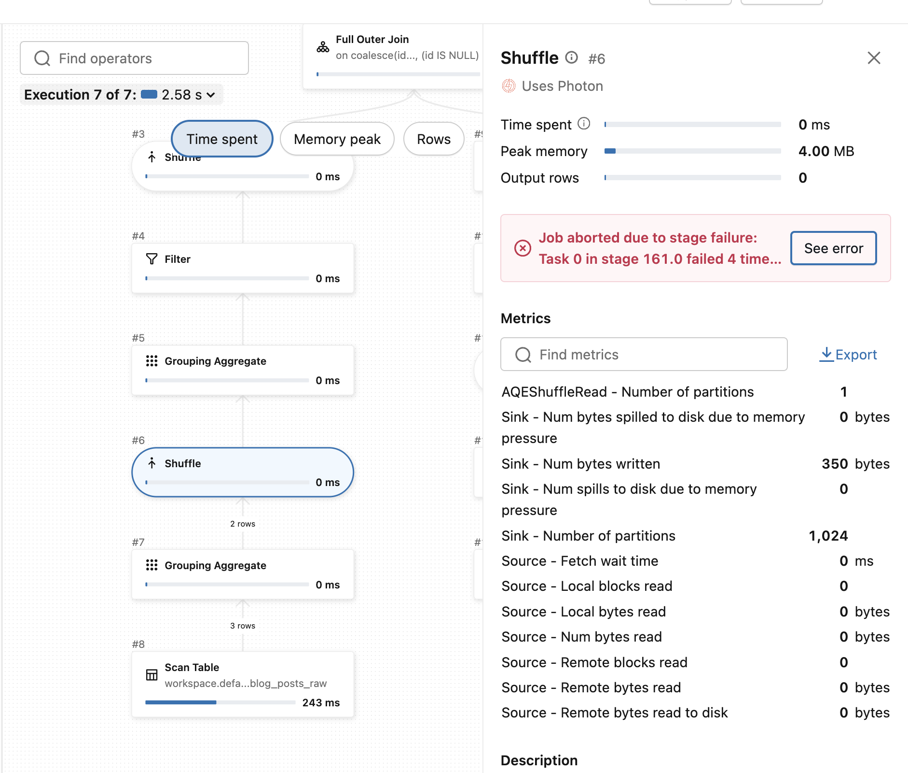