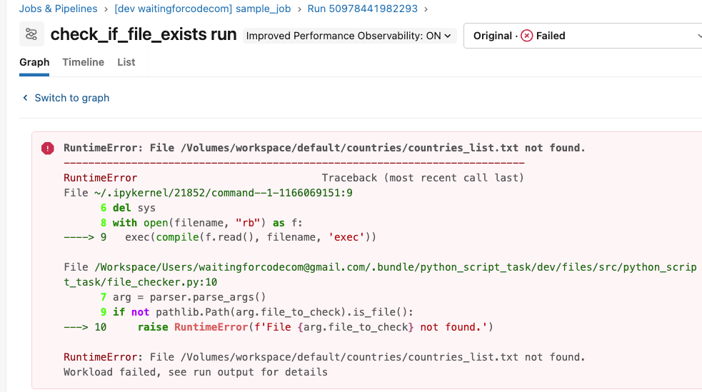
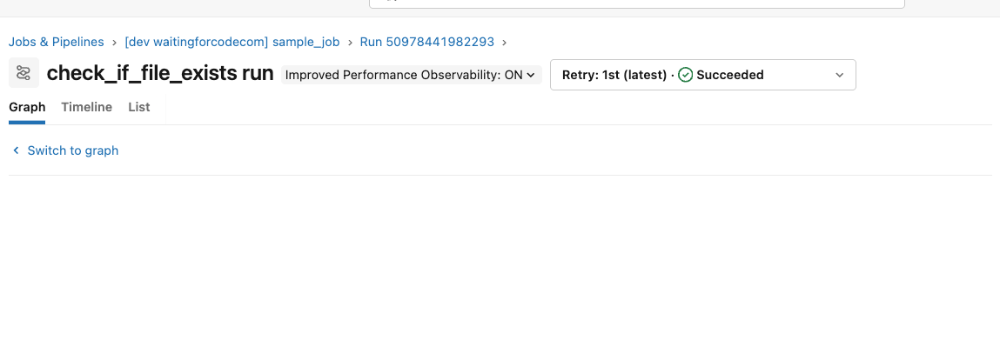
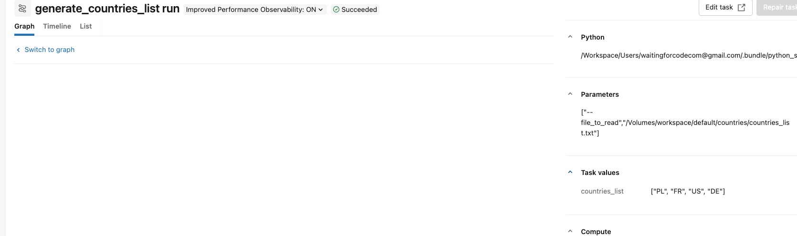
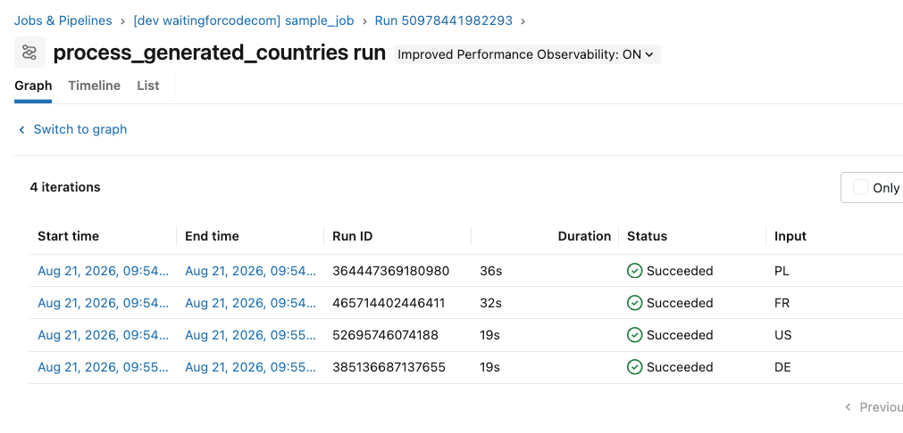

# Python script task demo

1. Configure your Databricks workspace, if you haven't done it yet:
```shell
databricks configure
```

Set your workspace host in [databricks.yml](databricks.yml)

2. To deploy a development copy of this project, type:
```shell
BROWSER="/Applications/Google Chrome.app/Contents/MacOS/Google Chrome" databricks auth login --profile personal_free_wfc 
databricks bundle deploy --target dev --profile personal_free_wfc
```

3. Go to your Databricks instance and create a new volume:
```sql
CREATE VOLUME IF NOT EXISTS workspace.default.countries;
```

4. Start the pipeline. The first task should fai:


5. Upload the [countries_list.txt](countries_list.txt) file to the created volume and wait 1 minute.
The check_if_file_exists task should succeed now and trigger the next task.



6. The generate_countries_list should trigger 4 tasks in Foreach Task group:



7. Go to your Databricks instance and delete a new volume:
```sql
DROP VOLUME workspace.default.countries;
```

8. Destroy the bundle:
```shell
databricks bundle destroy --target dev --profile personal_free_wfc
```